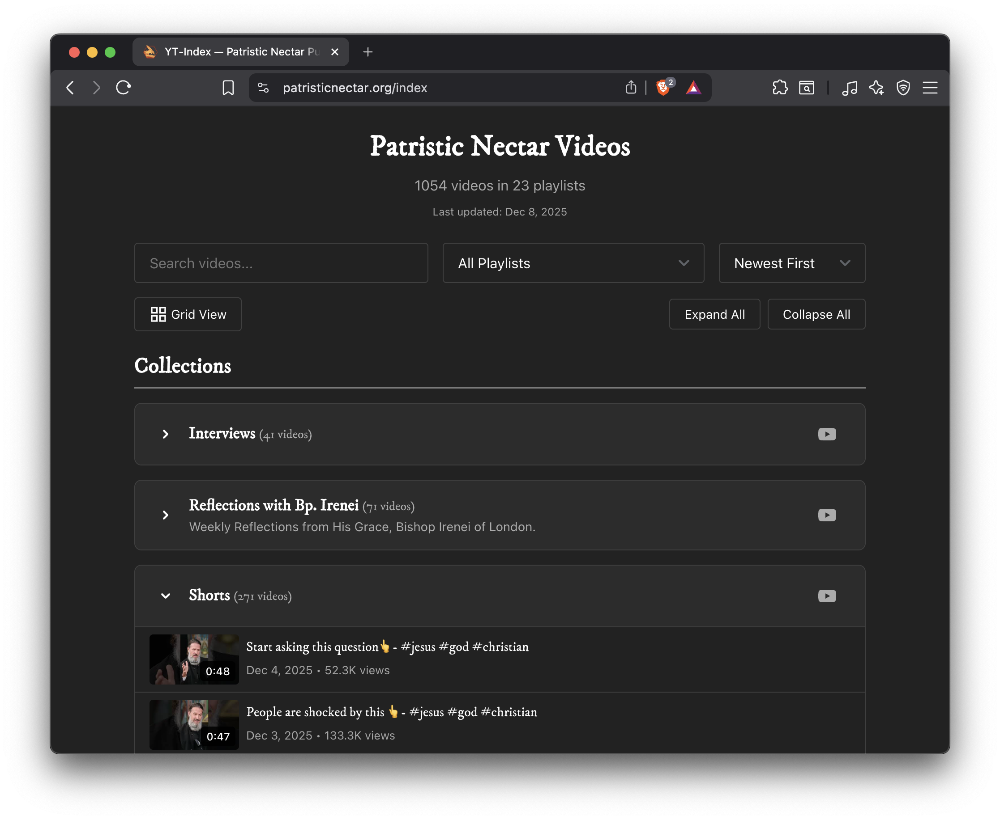

# Patristic Nectar YouTube Index

A simple and searchable index of all Patristic Nectar YouTube videos, organized by playlists.



## Tutorial

This index pulls all video and organization information from YouTube itself, which makes it simple to update from a single location.

### Playlists

The playlists themselves are direct copies of playlists from YouTube, so to add, remove, or update playlists, simply modify or create them as needed on YouTube. The index updates every 6 hours so the changes may take some time to reflect.

Any videos not in a playlist will be placed in an **"Uncategorized"** playlist at the bottom of the index.

### Categories

Playlists can be separated into major categories, such as Author, Topic, or anything else, to organize them cleanly in the index. These categories are completely customizable from YouTube. To change the category of a playlist, alter the playlist description by adding a tag at the end `` `[XXXX]` `` where XXXX is the name of the category.

Example Playlist Description for the "Authors" Category:
```
This playlist holds all of the videos from Fr. Josiah Trenham.
[Authors]
```

Any playlist not in a category will be placed in an **"Other"** category.

### Embeddable Widget

The index is embedded through the below code. Copy it into an HTML/Code block on Squarespace or another website to display the index.

```html
<div id="patristic-nectar-widget"></div>
<link rel="stylesheet" href="https://patristic-nectar.github.io/youtube-index/dist/widget.css">
<script src="https://patristic-nectar.github.io/youtube-index/dist/widget.js"></script>
```

## Technical information

### Rationale

This index was designed to be user-friendly and integrated with the current video upload flow to ensure that it is kept up-to-date easily. To accomplish this, all of the formatting/grouping information is stored in YouTube itself in the form of YouTube playlists and description tags. This has the added benefit of creating detailed playlists that anyone can view on YouTube itself or on this index.

### Implementation

#### Automatic Update System

Since all data is fetched from YouTube itself, we use a free API key stored as a [GitHub Secret](https://docs.github.com/en/actions/how-tos/write-workflows/choose-what-workflows-do/use-secrets). Every user loading the data directly from YouTube would surpass the limits of the free API key, so instead the data is fetched and cached in a GitHub Action every 6 hours. This system keeps the API key secure, ensures we can use the free API key tier, maintains performance when loading the index, and allows us to format the data properly for the index.

#### Widget

When embedded in a website, the widget fetches the index data from the public GitHub page and displays it. The widget supports sorting, filtering, and searching through every video and displaying the results in a few different formats. In addition, the widget follows the fonts and colors of the Squarespace website it is a part of, to prevent wonky colors if the website changes.
